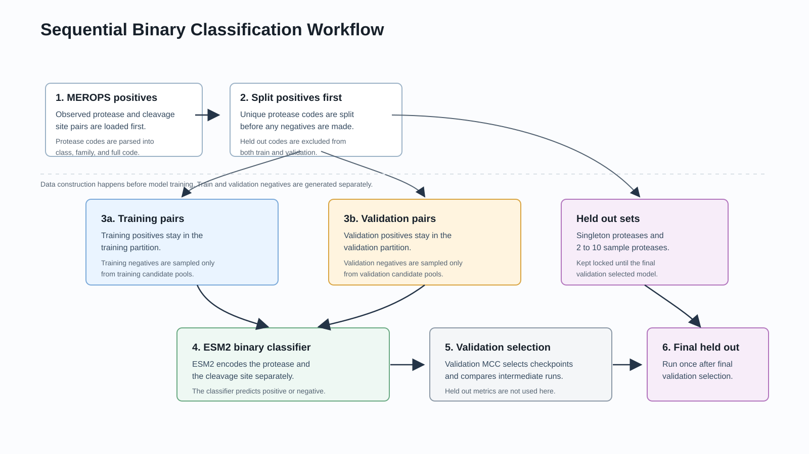
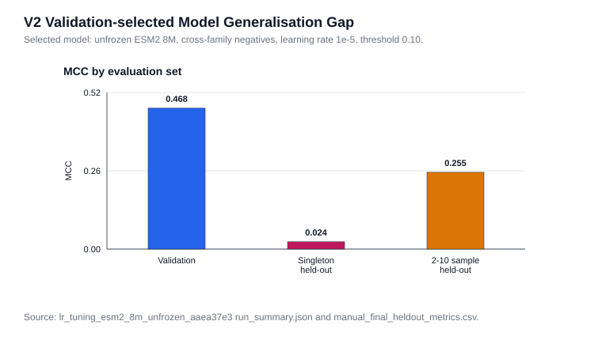

# ESM2 Protease Cleavage Prediction

**Predicting compatibility between a protease sequence and an eight-residue cleavage site using protein language models.**

James McClatchie · MSc Artificial Intelligence for Medicine & Medical Research · University College Dublin / Systems Biology Ireland · Research internship, 2026

[Final report](docs/Final_Report_Repo.pdf) · [Results](reports/sequential_binary_followup_result.md) · [Main notebook](notebooks/sequential_binary_followup_experiments.ipynb) · [Run guide](docs/REPRODUCIBILITY.md) · [Data requirements](docs/DATA.md)

## Research question

Can ESM2 representations distinguish observed protease–cleavage-site pairs from constructed negative pairs, and how well does that performance transfer to held-out proteases with few known substrates?

This public repository focuses on the binary classification workflow developed during my internship, supervised by Raúl Fernández Díaz. The work compares data selection, negative sampling, frozen versus fine-tuned encoders, model capacity and validation split design. Raw datasets, checkpoints, generated prediction files and contrastive-learning code are not included.

## Workflow



1. Load MEROPS-derived positive pairs and identify held-out protease codes.
2. Split development positives by protease code before generating negative pairs.
3. Construct negatives within each partition, excluding known positive code–site pairs.
4. Encode protease and cleavage-site sequences with ESM2 and train a binary classifier.
5. Select checkpoints, thresholds and configurations using validation MCC.
6. Evaluate the selected configuration on the separate singleton and 2–10-sample held-out sets.

The follow-up workflow records dataset hashes, pair manifests, seeds and run fingerprints. It asserts that training, validation and held-out protease-code groups remain separate.

## Model architecture

The same ESM2 encoder processes the protease and cleavage-site sequences separately. Attention-mask mean pooling and L2 normalisation produce two embeddings. Their concatenation, absolute difference and elementwise product feed a two-layer MLP with ReLU and dropout. Training uses binary cross-entropy with logits.

The experiments compare frozen ESM2 embeddings with end-to-end fine-tuning. The selected follow-up configuration uses **ESM2 8M, fine-tuned at `1e-5`, no clustering, cross-family negatives**, and a validation-selected threshold of **0.10**. Protease inputs are truncated to the configured token limit; the model does not explicitly simulate enzyme kinetics or molecular structure.

## Recorded results

| Evaluation | MCC | ROC AUC | Interpretation |
| --- | ---: | ---: | --- |
| Selected configuration: validation | **0.4681** | — | Best completed learning-rate follow-up by validation MCC |
| Held-out singleton proteases | **0.0241** | 0.5435 | Weak discrimination on the least-observed proteases |
| Held-out proteases with 2–10 samples | **0.2549** | 0.6719 | Better than the singleton set, but below validation performance |

These are historical results from the [recorded experiment summary](reports/sequential_binary_followup_result.md), not new runs performed during repository maintenance. A dash indicates that the metric is not supplied for that row in the summary.



Fine-tuning was the strongest validation direction among the completed follow-up runs. The generalisation gap is an important finding: validation performance alone did not establish reliable prediction for sparsely observed proteases.

The frozen 8M and 35M capacity checks recorded MCCs of 0.1914 and 0.1961. A later frozen 150M check recorded 0.0834, but used nine epochs rather than twenty and should be treated as additional evidence rather than a matched capacity comparison.

## Experiment sequence

| Workflow | Questions explored |
| --- | --- |
| [Original staged notebook](notebooks/sequential_binary_experiments.ipynb) | No clustering vs P1/1-mer selection vs 8-mer clustering; scrambled, random-site, cross-family and mixed negatives; frozen vs unfrozen ESM2 |
| [Follow-up notebook](notebooks/sequential_binary_followup_experiments.ipynb) | Corrected MEROPS family parsing, partition-local sampling, 8M/35M capacity, learning rates, validation split sensitivity and optional frozen 150M follow-up |

The original notebook is retained as a historical workflow. Its `family` field uses the first character of the MEROPS code; the follow-up parses full family prefixes such as `S01`. Their cross-family conditions therefore differ and should not be treated as identical experiments.

## Getting started

```bash
git clone https://github.com/JamesManOB/ESM2-protease-cleavage-prediction.git
cd ESM2-protease-cleavage-prediction
python -m venv .venv
# Activate .venv using the command for your operating system.
python -m pip install -r requirements.txt
python -m jupyterlab
```

Start with the follow-up notebook. Python 3.10 or newer is required by its type annotations. Training requires the original processed CSVs, Hugging Face model access/downloads and a suitable runtime; a GPU is recommended. Dependencies are listed but are not an exact lock of the original training environment.

The notebook defaults to a one-epoch validation-sensitivity smoke run. This uses a subset of your real input data, not a bundled demo. See the [run guide](docs/REPRODUCIBILITY.md) for inputs, full experiments, Colab, final evaluation and validation limits.

To check notebook syntax and configuration without loading data or models:

```bash
python -m unittest discover -s tests -v
```

## Limitations

- Negatives are constructed, presumed non-cleaving pairs rather than experimentally confirmed negatives. Unknown true positives may remain among them.
- Holding out protease codes does not guarantee sequence-homology separation. Family-stratified splits test unseen codes within represented families, not entirely unseen families.
- Checkpoint and threshold selection on the same validation set makes the final held-out results particularly important.
- The selected fine-tuned configuration is not accompanied by a multi-seed uncertainty estimate. The split-sensitivity experiment is a separate frozen-model analysis.
- The binary score is not a validated clinical probability, a measure of cleavage rate or evidence of therapeutic utility.
- Data and checkpoints are excluded. The public code documents the workflow but cannot reproduce the numerical results from a fresh clone alone.

## Repository guide

| Location | Contents |
| --- | --- |
| `notebooks/` | Historical staged workflow and maintained follow-up workflow |
| `docs/Final_Report_Repo.pdf` | Public final report |
| `docs/REPRODUCIBILITY.md` | Environment, execution stages and maintenance notes |
| `docs/DATA.md` | Expected inputs, field definitions and data boundaries |
| `reports/sequential_binary_followup_result.md` | Detailed recorded results and experimental settings |
| `reports/figures/` | Workflow and result figures |
| `tests/` | Lightweight notebook/configuration regression checks |

## Contribution and acknowledgements

My work in this repository covers the binary prediction experiments, comparisons of data and sampling choices, fine-tuning and capacity follow-ups, evaluation and reporting. The project uses MEROPS-derived data and pretrained ESM2 models through Hugging Face Transformers. Supervision was provided by Raúl Fernández Díaz at Systems Biology Ireland.

The public scope is deliberately limited to the binary workflow. This maintenance update does not add contrastive-learning material or change the original research results.
